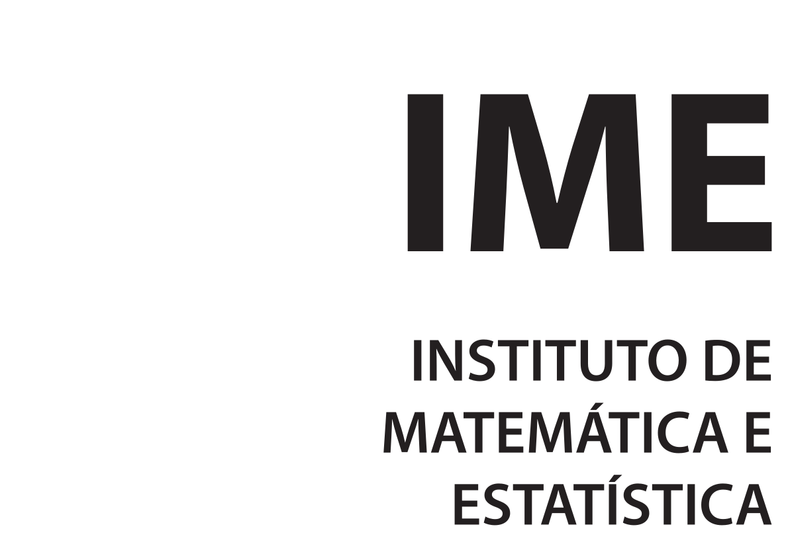

# UFG-MAC

<h3>Curso de Matemática Aplicada e Computacional IME-UFG.</h3>

    
    

# Sobre

O Bacharelado em Matemática Aplicada e Computacional tem como principal objetivo capacitar recursos humanos com uma sólida base matemática para, de modo crítico e criativo, modelar e resolver problemas provenientes de aplicações reais de diversas áreas do conhecimento e da indústria. Isso inclui a identificação, compreensão, formulação, análise e modelagem de problemas. Além disso, enfatizamos a implementação e simulação computacional, aplicação e desenvolvimento de técnicas que congregam o raciocínio matemático com cálculos científicos assistidos por computadores.

# Objetivo

A interdisciplinaridade é uma característica essencial do curso, refletindo-se transversalmente nas disciplinas e por meio de atividades optativas e de extensão. A articulação entre teoria e prática é ativamente promovida, incentivando a resolução de problemas reais e preparando os estudantes para desafios profissionais. [Refêrencia](https://ime.ufg.br/p/48490-matematica-aplicada-e-computacional/)

# Disciplinas do Curso

| Período    | Disciplina |
|------------|-----------------------------------------------------------------------------------------------------------------------------------|
| Primeiro | [CÁLCULO 1A ](https://github.com/henriquehsilva/I2A2-Training/tree/main/Challenge%201/Defective%20Equipment) |
| Primeiro | [FUNDAMENTOS DE MATEMÁTICA ](https://github.com/henriquehsilva/I2A2-Training/tree/main/Challenge%201/Defective%20Equipment) |
| Primeiro | [GEOMETRIA ANALÍTICA ](https://github.com/henriquehsilva/I2A2-Training/tree/main/Challenge%201/Defective%20Equipment) |
| Primeiro | [INTRODUÇÃO A COMPUTAÇÃO ](https://github.com/henriquehsilva/I2A2-Training/tree/main/Challenge%201/Defective%20Equipment) |

